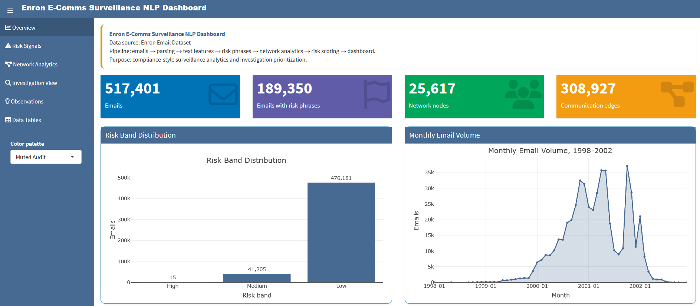
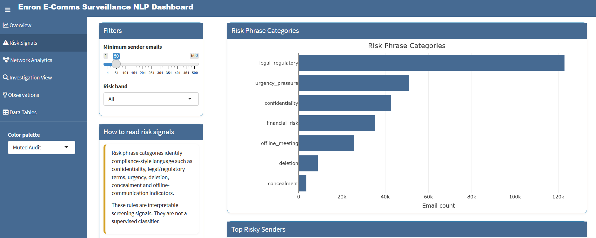

**Live dashboard:** https://skr-35.shinyapps.io/enron-ecomms-surveillance-nlp/

# Enron E-Comms Surveillance NLP

An end-to-end communications surveillance and investigation analytics platform built using the Enron Email Dataset.

The project combines:

* Email parsing
* NLP feature engineering
* Risk phrase detection
* Communication network analytics
* Risk scoring
* Interactive investigation dashboards

The workflow mirrors surveillance processes commonly used in:

* Financial Crime Compliance (FCC)
* AML Monitoring
* Market Surveillance
* Internal Audit
* Fraud Analytics
* Regulatory Investigations





---

# Project Goals

The objective is not to determine wrongdoing.

Instead, the framework aims to:

* Identify potentially risky communications
* Prioritize investigations
* Detect unusual communication patterns
* Highlight influential communication actors
* Support surveillance review workflows

---

# Dataset

Source:

Enron Email Dataset

Dataset size:

* 517,401 emails

Parsed successfully:

* 517,401 emails
* 12 parsing errors

Success rate:

* > 99.99%

---

# Key Capabilities

## 1. Email Parsing

Raw RFC-style emails are transformed into structured fields.

Examples:

* Sender
* Recipient
* Subject
* Date
* Folder
* Message body

---

## 2. NLP Feature Engineering

Generated features include:

* Subject length
* Body length
* Word count
* Sentence count
* Reply detection
* Forward detection
* Attachment indicators
* Capitalization ratio
* Exclamation count
* Question mark count

---

## 3. Risk Phrase Detection

Rule-based surveillance dictionaries identify:

### Confidentiality

* confidential
* privileged
* internal use only

### Concealment

* keep this between us
* off the record
* do not tell

### Deletion

* delete this
* destroy
* erase

### Regulatory Risk

* audit
* regulator
* subpoena
* investigation

### Financial Risk

* fraud
* manipulate
* bankruptcy
* default

---

## 4. Network Analytics

Communication graph:

Node:

* Email address

Edge:

* Sender → Recipient

Network size:

* ~25,600 nodes
* ~309,000 edges

Metrics:

* In-degree
* Out-degree
* Degree centrality
* Betweenness centrality

---

## 5. Risk Scoring

Composite surveillance score based on:

| Component              | Weight |
| ---------------------- | ------ |
| Risk Phrase Score      | 40%    |
| Network Volume         | 20%    |
| Betweenness Centrality | 20%    |
| Sender Activity        | 10%    |
| Text Intensity         | 10%    |

Risk bands:

| Band   | Score |
| ------ | ----- |
| Low    | < 40  |
| Medium | 40-74 |
| High   | ≥ 75  |

---

## 6. Interactive Dashboard

Dashboard pages:

* Communication Overview
* Risk Signals
* Investigation View
* Observations

Features:

* KPI monitoring
* Risk band analysis
* Monthly activity trends
* Entity investigation
* Ego-network visualization
* Risk score drill-down

---

# Project Architecture

```text
Enron-EComms-Surveillance-NLP/
│
├── app.R
├── deploy_shinyapps.R
├── Dockerfile
├── README.md
├── LICENSE
│
├── data/
│   ├── raw/
│   ├── interim/
│   ├── processed/
│   └── dashboard/
│
├── scripts/
│   ├── 00_inspect_raw.py
│   ├── 01_parse_emails.py
│   ├── 02_profile_parsed_emails.py
│   ├── 03_create_text_features.py
│   ├── 04_detect_risk_phrases.py
│   ├── 05_build_network_edges.py
│   ├── 06_compute_network_metrics.py
│   ├── 07_create_risk_scores.py
│   ├── 08_export_dashboard_data.py
│   └── 09_normalize_dates.py
│
├── notebooks/
│
├── tests/
│
└── reports/
    └── methodology.md
```

---

# Testing

Automated validation includes:

* Email parsing
* Risk scoring
* Network metrics
* Pipeline integrity

Current status:

* 11 tests passed

---

# Run Dashboard

```r
shiny::runApp()
```

---

# Deploy

```r
source("deploy_shinyapps.R")
```

---

# Docker

Build:

```bash
docker build -t enron-surveillance .
```

Run:

```bash
docker run --rm -p 3838:3838 enron-surveillance
```

Open:

http://localhost:3838

---

# Disclaimer

This project is intended for educational, analytical and surveillance demonstration purposes.

Risk scores and risk indicators do not constitute evidence of misconduct.

All outputs should be treated as review signals requiring further investigation and professional judgment.